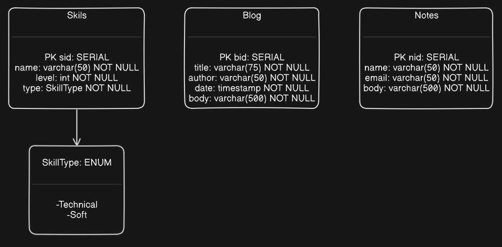

# [Samuel Steiger's Personal Website](https://samcsteiger.net)

Welcome to my personal website! You can check it out by cloning the repo or clicking the link above. This website is meant to reflect my progress and growth as a developer. I will endever to return and update this repo as I learn more and keep it up to date with everythin I know about web development. the content of this website serves as an extension to a one-page resume, showcasing more about myself.

## Layout

The website is divided into three sections: About Me, Projects and Blog. The About Me section is my bio. The Projects page will serve as my portfolio, containing details about this as well as future projects I work on. The Blog page is simply my personal blog, containing my thoughts and ideas as continue down my developer journey.

## Features

### Client

The client uses the React.js framework to acheive the dynamic elements of webpage. Axios is used to make requests to the server. React-Router is the backbone of the navigateion bar.

### Server

The server uses the Node.js framework. Express handles requests made to the server and routes them to the approprate handlers. THe Express Validator/Sanitizer library is used for all user inputs in order to ensure they meet requirements and are properly escaped.

### Database

The database is PostgreSQL. The tables that enable the front end features are as follows: 